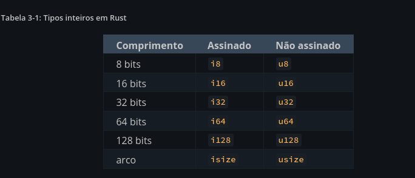

# Conceito comuns de programação rust


## 3.1 - Variáveis e Mutabilidade

* Por padrão as variaveis são IMUTÁVEIS

```rs
    let x  = 5
    x + 2 // isso gerar um erro no  compilador
```

* Para tornar a variável mutável, basta adicionar o modificador `mut` antes da variável

```rs
    let mut x = 5
    x + 2 // isso não gerar um erro no  compilador
```

* Constantes são sempre imutáveis e devem ser declaradas com a palavra reservada `const`, a principal diferença entre constantes e variáveis é que constantes devem ser declaradas com um tipo de dado e não podem ser declaradas com um valor que só pode ser calculado em tempo de execução

```rs
    const MAX_POINTS: u32 = 100_000;

```rs
    const MAX_POINTS: u32 = 100_000;
```

* Shadowing é uma técnica que permite redefinir uma variável, porém com um novo tipo de dado, diferente de mutabilidade, que permite apenas a redefinição do valor da variável

```rs
    let x = 5;
    let x = x + 1;
    let x = x * 2;
    let x = 'a';
```


## 3.2 - Tipos de Dados

Todo valor em Rust é de um tipo de dado, que pode ser dividido em dois grupos: escalares e compostos.Rust é uma linguagem de tipagem estática, o que significa que deve-se declarar o tipo de dado de cada variável em tempo de compilação. O compilador é capaz de inferir o tipo de dado da variável, mas é uma boa prática declarar o tipo de dado explicitamente.

```rs
    let guess: u32 = "42".parse().expect("Not a number!");
```

### 3.2.1 - Tipos Escalares

Um tipo escalar representa um único valor. Rust possui quatro tipos escalares: inteiros, ponto flutuante, booleanos e caracteres.

#### Tipos Inteiros

Os tipos inteiros são representados por numeros sem fração. Rust possui os seguintes tipos inteiros: Assinados e não assinados, os inteiros assinados são representados pela letra `i` seguida do número de bits que o tipo possui, já os inteiros não assinados são representados pela letra `u` seguida do número de bits que o tipo possui.

A diferença entre o valor assinado e não assinado é que o valor assinado pode ser positivo ou negativo, enquanto o valor não assinado só pode ser positivo.



```rs
    let x: i8 = 127;
    let y: u8 = 255;

```rs
    let x: i8 = 127;
    let y: u8 = 255;
```

#### Tipos Ponto Flutuante

Os tipos ponto flutuante são representados por números com fração. Rust possui dois tipos ponto flutuante: `f32` e `f64`, que representam números de 32 bits e 64 bits, respectivamente.

```rs
    let x: f32 = 3.14;
    let y: f64 = 3.14;
```

Os números de ponto flutuante são representados de acordo com o padrão IEEE-754. O f32tipo é um float de precisão simples e f64possui precisão dupla.

#### Operações

Em rust é possível realizar operações aritméticas com os tipos de dados escalares, como soma, subtração, multiplicação, divisão e resto da divisão.  A divisão inteira trunca em direção a zero para o número inteiro mais próximo.

```rs
    let soma = 5 + 10; // 15
    let subtracao = 95.5 - 4.3; // 91.2
    let multiplicacao = 4 * 30; // 120
    let divisao = 56.7 / 32.2; // 1.7608695652173913
    let resto = 43 % 5; // 3
    let divisao_inteira = 43 / 5; // 8
```

#### Tipo Booleano

O tipo booleano é representado por dois valores: `true` e `false`. Rust possui um tipo de dado booleano chamado `bool`.

```rs
    let verdadeiro = true;
    let falso = false;
```

#### Tipo Caractere

O tipo caractere é representado por um caractere Unicode, que é representado por aspas simples. Rust possui um tipo de dado caractere chamado `char`. observação: os char literais são especificados com aspas simples, pois as aspas duplas são reservadas para strings.

```rs
    let caractere = 'a';
    let c = 'z';
    let z: char = 'ℤ'; // with explicit type annotation
    let heart_eyed_cat = '😻';
```

### 3.2.2 - Tipos Compostos

Um tipo composto representa um valor que pode conter vários valores. Rust possui dois tipos compostos: tuplas e arrays.

#### Tuplas

Uma tupla é um tipo composto que pode conter vários valores de tipos diferentes. As tuplas são representadas por parênteses e os valores são separados por vírgulas.

```rs
    let tupla: (i32, f64, u8) = (500, 6.4, 1);
```

Para acessar os valores de uma tupla, é possível utilizar a notação de ponto seguida do índice do valor.

```rs
    let tupla: (i32, f64, u8) = (500, 6.4, 1);
    let (x, y, z) = tupla; // desestruturação
    let x = tupla.0;
    let y = tupla.1;
    let z = tupla.2;
```

Para acessar os valores de uma tupla, é possível utilizar a notação de ponto seguida do índice do valor.

```rs
    let tupla: (i32, f64, u8) = (500, 6.4, 1);
    let (x, y, z) = tupla; // desestruturação
    let x = tupla.0; // usando a notação de ponto
    let y = tupla.1;
    let z = tupla.2;
```

#### Arrays

Um array é um tipo composto que pode conter vários valores do mesmo tipo. Os arrays são representados por colchetes e os valores são separados por vírgulas. Em Rust, os arrays têm um tamanho fixo e não podem crescer ou encolher.

```rs
    let array: [i32; 5] = [1, 2, 3, 4, 5];

    // os meses do ano
    let meses = ["Janeiro", "Fevereiro", "Março", "Abril", "Maio", "Junho", "Julho", "Agosto", "Setembro", "Outubro", "Novembro", "Dezembro"];

    let a = [3; 5]; // [3, 3, 3, 3, 3]

```

Para acessar os valores de um array, é possível utilizar a notação de ponto seguida do índice do valor.

```rs
    let array: [i32; 5] = [1, 2, 3, 4, 5];
    let primeiro = array[0];
    let segundo = array[1];
```

Se tentar acessar um índice que não existe no array, o compilador irá gerar um erro.

```rs
    let array: [i32; 5] = [1, 2, 3, 4, 5];
    let sexto = array[5]; // erro: índice fora dos limites do array
```

### Conclusão

Neste capítulo, aprendemos sobre variáveis, mutabilidade, constantes e tipos de dados em Rust. Aprendemos que as variáveis são imutáveis por padrão e que é possível torná-las mutáveis com a palavra reservada `mut`. Aprendemos que as constantes são sempre imutáveis e devem ser declaradas com a palavra reservada `const`. Aprendemos sobre tipos de dados escalares, como inteiros, ponto flutuante, booleanos e caracteres. Aprendemos sobre tipos de dados compostos, como tuplas e arrays. Aprendemos como acessar os valores de uma tupla e de um array.

## 3.3 - Funções

As funções são blocos de código que realizam uma tarefa específica. Em Rust, as funções são declaradas com a palavra reservada `fn`, seguida do nome da função e dos parâmetros da função. A função main é a função principal de um programa Rust e é o ponto de entrada do programa. Por padrão o codigo rust usar para nomear as funções o padrão snake_case.

```rs
    fn main() {
        println!("Olá, mundo!");
    }

    fn minha_funcao() {
        println!("Minha função!");
    }

```

### Parâmetros

Os parâmetros de uma função são declarados entre parênteses após o nome da função. Os parâmetros são separados por vírgulas e cada parâmetro deve ter um tipo de dado associado.

```rs
    fn main() {
        println!("Hello, world!");

        let valor = 10;
        let unidade = "teste".to_string();

        outra_funcao(valor, unidade);
    }

    fn outra_funcao(value: i32, label: String) {
        println!("O valor é: {}", value);
        println!("A unidade é: {}", label);
    }

```

### Declarações e Expressões

Em Rust, as funções podem conter declarações e expressões. Uma declaração é uma instrução que realiza uma tarefa, como declarar uma variável ou chamar uma função. Uma expressão é uma instrução que retorna um valor. Em Rust, as expressões não terminam com ponto e vírgula, enquanto as declarações terminam com ponto e vírgula.

```rs
    fn main() {
        let x = 5;
        let y = { // o trecho de código entre chaves é uma expressão
            let x = 3;
            x + 1
        };

        println!("O valor de y é: {}", y);
    }

```

### Retorno de Funções

As funções em Rust podem retornar um valor utilizando a palavra reservada `return` seguida do valor a ser retornado ou simplesmente retornando o valor sem a palavra reservada `return` porém na última linha.

```rs
    fn main() {
        let x = 5;
        let y = 10;

        let resultado = soma(x, y);

        println!("O resultado da soma é: {}", resultado);
    }

    fn soma(a: i32, b: i32) -> i32 {
        //a + b; // erro: a expressão não retorna um valor
        a + b
    }

```

### Conclusão

Neste capítulo, aprendemos sobre funções em Rust. Aprendemos que as funções são blocos de código que realizam uma tarefa específica. Aprendemos que as funções são declaradas com a palavra reservada `fn`, seguida do nome da função e dos parâmetros da função. Aprendemos sobre os parâmetros de uma função e como declará-los. Aprendemos sobre declarações e expressões em Rust e como elas são utilizadas em funções. Aprendemos sobre o retorno de funções e como as funções podem retornar um valor.

## 3.4 - Controle de Fluxo
