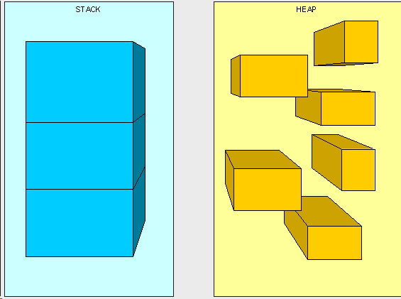
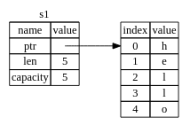
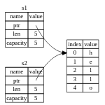
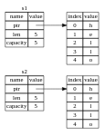

# O que é propriedade no rust

É conjunto de regras qye regem como um programa rust gerencia a memoria. Todos os programas precisam gerenciar a maneira como usam a memória do computador durante a execução. Algumas linguagens o programador deve alocar e liberar explicitamente a memória. Rust usa uma terceira abordagem: a memória é gerenciada por meio de um sistema de propriedade com um conjunto de regras que o compilador verifica. Se alguma das regras for violada, o programa não será compilado. Nenhum dos recursos de propriedade tornará seu programa lento enquanto ele estiver em execução.


## Conceitos de pinha

 A pilha armazena valores na ordem em que os obtém e remove os valores na ordem oposta. Isso é conhecido como último a entrar, primeiro a sair(lifo) . Pense em uma pilha de pratos: quando você adiciona mais pratos, você os coloca em cima da pilha, e quando precisa de um prato, você tira um de cima. Adicionar ou remover placas do meio ou da parte inferior não funcionaria tão bem! Adicionar dados é chamado de colocar na pilha , e remover dados é chamado de retirar da pilha . Todos os dados armazenados na pilha devem ter um tamanho fixo e conhecido.


## Conceitos de heap


O heap é menos organizado: quando você coloca dados no heap, você solicita uma certa quantidade de espaço. O alocador de memória encontra um espaço vazio no heap que seja grande o suficiente, marca-o como em uso e retorna um ponteiro , que é o endereço desse local. Esse processo é chamado de alocação no heap e às vezes é abreviado como apenas alocação (enviar valores para a pilha não é considerado alocação). Como o ponteiro para o heap tem um tamanho fixo e conhecido, você pode armazenar o ponteiro na pilha, mas quando quiser os dados reais, deverá seguir o ponteiro. Pense em estar sentado em um restaurante. Ao entrar, você informa a quantidade de pessoas do seu grupo, e o anfitrião encontra uma mesa vazia que cabe a todos e o leva até lá. Se alguém do seu grupo chegar atrasado, poderá perguntar onde você está sentado para encontrá-lo.




## Conceitos de propriedade

Acessar dados no heap é mais lento do que acessar dados na pilha porque você precisa seguir um ponteiro para chegar lá. Os processadores contemporâneos são mais rápidos se movimentarem menos memória. Continuando a analogia, considere um garçom em um restaurante recebendo pedidos de muitas mesas. É mais eficiente colocar todos os pedidos em uma mesa antes de passar para a próxima. Receber um pedido da tabela A, depois um pedido da tabela B, depois um de A novamente e depois um de B novamente seria um processo muito mais lento. Da mesma forma, um processador pode fazer seu trabalho melhor se trabalhar com dados próximos de outros dados (como estão na pilha) em vez de mais distantes (como podem estar na pilha). 


# Regras de propriedade

1. Cada valor em Rust tem uma variável que é chamada de seu proprietário.
2. Um valor só pode ter um proprietário por vez.
3. Quando o proprietário sai do escopo, o valor será descartado.

# Escopo de variável

```rs
    let s = "hello";
```

A variável `s` é uma variável de propriedade. Quando `s` entra no escopo, ele é o proprietário do valor `"hello"`. Quando `s` sai do escopo, o valor será descartado.


# O tipo String

a pilha quando seu escopo termina e pode ser copiado de forma rápida e trivial para criar uma instância nova e independente se outra parte do código precisar usar o mesmo valor em um escopo diferente. Mas queremos observar os dados armazenados no heap e explorar como Rust sabe quando limpar esses dados, e o Stringtipo é um ótimo exemplo.

```rs
    let s1 = String::from("hello");
    let s2 = s1;
```

O operador de dois pontos duplos ::nos permite colocar o nome desta from função específica sob o tipo String, em vez de usar algum tipo de nome como string_from

```rs
    let mut s = String::from("hello");
    s.push_str(", world!"); //append a literal to a String
    println!("{}", s); // isso vai imprimir `hello, world!`
```

ntão, qual é a diferença aqui? Por que pode Stringsofrer mutação, mas os literais não? A diferença está na forma como esses dois tipos lidam com a memória.

# Memória e alocação

A memória é alocada em algum lugar e, em seguida, é liberada quando não é mais necessária. Podemos alocar um pedaço de memória em tempo de execução e, em seguida, liberá-lo quando terminarmos com ele. Isso é exatamente o que acontece com literais de string: eles são rápidos e eficientes porque são imutáveis e armazenados diretamente na pilha.

Com o tipo String, para suportar um trecho de texto mutável e expansível, precisamos alocar uma quantidade de memória no heap, desconhecida em tempo de compilação, para armazenar o conteúdo. Isso significa:

* A memória deve ser solicitada ao alocador de memória em tempo de execução.
* Precisamos de um meio de devolver essa memória ao alocador quando terminarmos com nossa String.

Essa primeira parte é feita pela função String::from, que solicita a quantidade de memória necessária ao alocador. Esta é uma operação um pouco mais cara do que copiar um pedaço de texto para a pilha, mas é necessária para suportar a capacidade de expansão da String.

A segunda parte é diferente. Em linguagens com coletor de lixo (GC) , o GC monitora e limpa a memória que não está mais sendo usada e não precisamos pensar nisso. Na maioria das linguagens sem GC, é nossa responsabilidade identificar quando a memória não está mais sendo usada e chamar o código para liberá-la explicitamente, assim como fizemos para solicitá-la. Fazer isso corretamente tem sido historicamente um problema de programação difícil. Se esquecermos, desperdiçaremos memória. Se fizermos isso muito cedo, teremos uma variável inválida. Se fizermos isso duas vezes, isso também será um bug. Precisamos emparelhar exatamente um allocatecom exatamente um free.

Rust segue um terceiro caminho: a memória é liberada automaticamente quando a variável que a possui sai do escopo. Aqui está o que isso parece:

```rs
    {
        let s = String::from("hello"); // s é válido a partir deste ponto
        // faça algo com s
    } // este escopo termina, e s não é mais válido
```

## variáveis e dados interagindo: movimento

```rs
    let x = 5;
    let y = x;
```

Provavelmente podemos adivinhar o que isso está fazendo: “vincular o valor 5a x; em seguida, faça uma cópia do valor xe vincule-o a y.” Agora temos duas variáveis, x e y, e ambas iguais 5. Na verdade, é isso que está acontecendo, porque os números inteiros são valores simples com um tamanho fixo e conhecido, e esses dois 5valores são colocados na pilha.

Agora vamos olhar para o que acontece quando fazemos isso com uma String:

```rs
    let s1 = String::from("hello");
    let s2 = s1;
```

Isso é muito semelhante, então podemos assumir que a forma como funciona seria a mesma: ou seja, a segunda linha faria uma cópia do valor in s1e o vincularia a s2. Mas não é bem isso que acontece.

 A String é composto de três partes, mostradas à esquerda: um ponteiro para a memória que contém o conteúdo da string, um comprimento e uma capacidade. Este grupo de dados é armazenado na pilha. À direita está a memória na pilha que contém o conteúdo.



O comprimento é a quantidade de memória, em bytes, que o conteúdo do Stringestá usando atualmente. A capacidade é a quantidade total de memória, em bytes, que Stringrecebeu do alocador. A diferença entre comprimento e capacidade é importante, mas não neste contexto, portanto, por enquanto, não há problema em ignorar a capacidade.


Quando atribuímos s1 s2, os String de dados são copiados, ou seja, copiamos o ponteiro, o comprimento e a capacidade que estão na pilha. Não copiamos os dados no heap ao qual o ponteiro se refere. Em outras palavras, a representação dos dados na memória é assim:



Anteriormente, dissemos que quando uma variável sai do escopo, Rust chama automaticamente a dropfunção e limpa a memória heap dessa variável. Mas a Figura 4-2 mostra ambos os ponteiros de dados apontando para o mesmo local. Isso é um problema: quando s2e s1sair do escopo, ambos tentarão liberar a mesma memória. Isso é conhecido como erro duplo livre e é um dos bugs de segurança de memória que mencionamos anteriormente. Liberar memória duas vezes pode causar corrupção de memória, o que pode levar a vulnerabilidades de segurança.

Para garantir a segurança da memória, após a linha let s2 = s1;, Rust considera s1como inválido. Portanto, Rust não precisa liberar nada quando s1sai do escopo. Confira o que acontece quando você tenta usar s1depois s2de criado; não vai funcionar:

```rs
    let s1 = String::from("hello");
    let s2 = s1;
    println!("{}, world!", s1); // erro!, s1 não é mais válido
```

Em rust, essa operação é conhecida como 'move'. Em vez de fazer uma cópia profunda dos dados heap, Rust considera s1inválido e não precisamos liberar nada quando s1 sai do escopo, um detalhe importante a ser lembrado que s1 não é uma copia superficial, mas sim uma movimentação de dados em que s1 se torna invalido.Rust nunca faz automaticamente “profundamente” copiar seus dados

## Clonar

Se quisermos copiar profundamente os dados heap de uma String, não apenas os dados da pilha, podemos usar um método chamado clone.

```rs
    let s1 = String::from("hello");
    let s2 = s1.clone();
    println!("s1 = {}, s2 = {}", s1, s2);
```



## dados somente de pinhar

Os tipos de dados que são copiados da pilha são conhecidos como tipos de dados somente de pinhar porque eles podem ser armazenados na pilha. Os tipos de dados que são copiados da pilha são copiados rapidamente porque os dados são pequenos o suficiente para serem armazenados na pilha. Aqui estão alguns dos tipos que são tipos de dados somente de pinhar:

* Todos os inteiros, como u32.
* Booleanos, bool, com valores truee false.
* Todos os tipos de ponto flutuante, como f64.
* Caracteres, char.
* Tuplas, se contiverem tipos de dados somente de pinhar; por exemplo, (i32, i32)é um tipo de dados somente de pinhar, mas (i32, String)não é.

## Propriedade e funções

```rs
    fn main() {
        let s = String::from("hello");  // s entra no escopo

        takes_ownership(s);             // s é movido para dentro da função
                                        // então não podemos mais usar s aqui

        let x = 5;                      // x entra no escopo

        makes_copy(x);                  // x seria copiado se fosse copiável, mas
                                        // como i32 é copiável, ainda podemos
                                        // usar x depois dessa chamada de função

    } // aqui, s sai do escopo e é liberado

    fn takes_ownership(some_string: String) { // some_string entra no escopo
        println!("{}", some_string);
    } // aqui, some_string sai do escopo e é liberado

    fn makes_copy(some_integer: i32) { // some_integer entra no escopo
        println!("{}", some_integer);
    } // aqui, some_integer sai do escopo e é liberado
```


## Valores de retorno e escopo

A devolução de valores também pode transferir a propriedade. 

```rs
    fn main() {
        let s1 = gives_ownership();         // gives_ownership move seu valor de retorno para s1

        let s2 = String::from("hello");     // s2 entra no escopo

        let s3 = takes_and_gives_back(s2);  // s2 é movido para
                                            // takes_and_gives_back, que também
                                            // move seu valor de retorno para s3
    } // aqui, s3 sai do escopo e é liberado. s2 também sai do escopo, mas já foi movido,
      // então nada acontece. s1 sai do escopo e é liberado.

    fn gives_ownership() -> String {             // gives_ownership vai mover seu
                                                // valor de retorno para a função
                                                // que chama gives_ownership
        let some_string = String::from("hello"); // some_string entra no escopo
        some_string                              // some_string é retornado e
                                                // movido para a função que chama
                                                // gives_ownership
    }

    // takes_and_gives_back vai receber uma String e retornar uma String
    fn takes_and_gives_back(a_string: String) -> String { // a_string entra no escopo

        a_string  // a_string é retornado e movido para a função que chama
                  // takes_and_gives_back
    }
```

A propriedade de uma variável sempre segue o mesmo padrão: atribuir um valor a outra variável a move. Quando uma variável que inclui dados no heap sai do escopo, o valor será limpo, dropa menos que a propriedade dos dados tenha sido movida para outra variável.

Embora isso funcione, assumir a propriedade e depois devolvê-la a cada função é um pouco entediante. E se quisermos permitir que uma função use um valor, mas não assuma a propriedade? É muito chato que tudo o que passamos também precise ser devolvido se quisermos usá-lo novamente, além de quaisquer dados resultantes do corpo da função que possamos querer retornar também.

Rust nos permite retornar vários valores usando uma tupla

```rs
    fn main() {
        let s1 = String::from("hello");

        let (s2, len) = calculate_length(s1);

        println!("The length of '{}' is {}.", s2, len);
    }

    fn calculate_length(s: String) -> (String, usize) {
        let length = s.len(); // len() retorna o comprimento de uma String

        (s, length)
    }
```

Em vez de uma única String, a função agora retorna uma tupla que contém uma String e um usize. Podemos então desestruturar a tupla em suas partes individuais, assim como fizemos com a tupla de parâmetros.

Mas isso é muita cerimônia e muito trabalho para um conceito que deveria ser comum. Felizmente para nós, Rust possui um recurso para usar um valor sem transferir propriedade, chamado de referências .