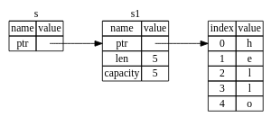

# Imprestimo de Referências

Em rust é possível enviar a referência de um valor para uma função, sem que a função tome posse do valor. Isso é feito através do uso do operador `&`. O operador `&` é usado para criar uma referência a um valor. Por exemplo:

```rs

fn main() {
    let s1 = String::from("hello");

    let len = calculate_length(&s1);

    println!("The length of '{s1}' is {len}."); // isso funciona!, s1 não foi tomado posse pela função calculate_length
}

fn calculate_length(s: &String) -> usize { // s é uma referência a um String, 
    s.len()
}// Aqui, s vai fora do escopo. Mas porque não é o dono do valor, nada acontece.

```
Primeiro, observe que todo o código da tupla na declaração da variável e no valor de retorno da função desapareceu. Em segundo lugar, note que passamos &s1para calculate_lengthe, na sua definição, tomamos &Stringem vez de String. Esses e comerciais representam referências e permitem que você se refira a algum valor sem se apropriar dele.



O oposto de referenciar usando (&) é desreferenciar (*), que é realizado com o operador de desreferenciar *


A &s1sintaxe nos permite criar uma referência que se refere ao valor, s1 mas não o possui. Por não ser proprietário, o valor para o qual aponta não será descartado quando a referência parar de ser usada.

Da mesma forma, a assinatura da função serve &para indicar que o tipo do parâmetro sé uma referência. Vamos adicionar algumas anotações explicativas:

Quando as funções têm referências como parâmetros em vez dos valores reais, não precisaremos retornar os valores para devolver a propriedade, porque nunca tivemos propriedade.

Chamamos a ação de criar um empréstimo de referência . Como na vida real, se uma pessoa possui algo, você pode pedir emprestado a ela. Quando terminar, você terá que devolvê-lo. Você não é o dono disso.

```rs
fn main() {
    let s = String::from("hello");

    change(&s);
}

fn change(some_string: &String) {
    some_string.push_str(", world"); // Erro! não é possível modificar um valor referenciado
}

```

Assim como as variáveis ​​são imutáveis ​​por padrão, as referências também o são. Não temos permissão para modificar algo ao qual temos referência. 


## Referências Mutáveis

para nos permitir modificar um valor emprestado com apenas alguns pequenos ajustes que usam, em vez disso, uma referência mutável : &mut T.

```rs
fn main() {
    let mut s = String::from("hello");

    change(&mut s);
}

fn change(some_string: &mut String) {
    some_string.push_str(", world");
}
```

As referências mutáveis ​​têm uma grande restrição: se você tiver uma referência mutável para um valor, não poderá ter outras referências para esse valor. Este código que tenta criar duas referências mutáveis s​​falhará:

```rs
let mut s = String::from("hello");

let r1 = &mut s;
let r2 = &mut s; // erro, não é possível ter duas referências mutáveis de um mesmo valor 
println!("{}, {}", r1, r2);
```

Este erro indica que este código é inválido porque não podemos emprestar scomo mutável mais de uma vez por vez. O primeiro empréstimo mutável está incluído r1e deve durar até ser usado no println!, mas entre a criação dessa referência mutável e seu uso, tentamos criar outra referência mutável r2que empresta os mesmos dados do r1.

A restrição que impede múltiplas referências mutáveis ​​aos mesmos dados ao mesmo tempo permite a mutação, mas de uma forma muito controlada. É algo que os novos Rustáceos enfrentam porque a maioria dos idiomas permite que você sofra mutação sempre que desejar. A vantagem de ter essa restrição é que o Rust pode evitar corridas de dados em tempo de compilação. Uma corrida de dados é semelhante a uma condição de corrida e ocorre quando ocorrem estes três comportamentos:

Dois ou mais ponteiros acessam os mesmos dados ao mesmo tempo.
Pelo menos um dos ponteiros está sendo usado para gravar nos dados.
Não há nenhum mecanismo sendo usado para sincronizar o acesso aos dados.
Corridas de dados causam comportamento indefinido e podem ser difíceis de diagnosticar e corrigir quando você tenta rastreá-las em tempo de execução; Rust evita esse problema recusando-se a compilar código com corridas de dados!

Como sempre, podemos usar chaves para criar um novo escopo, permitindo múltiplas referências mutáveis, mas não simultâneas :


```rs
let mut s = String::from("hello");

{
    let r1 = &mut s;
} // r1 sai do escopo aqui, então podemos criar uma nova referência mutável

let r2 = &mut s;
```

Rust impõe uma regra semelhante para combinar referências mutáveis ​​e imutáveis. Este código resulta em um erro:

Este código não compila!


```rs

    let mut s = String::from("hello");

    let r1 = &s; // no problem
    let r2 = &s; // no problem
    let r3 = &mut s; // BIG PROBLEM, não é possível ter uma referência mutável enquanto tivermos uma imutável, como no caso de r1 e r2 ainda são usadas o  r3 não pode ser criada

    println!("{}, {}, and {}", r1, r2, r3);


```

Uau! Também não podemos ter uma referência mutável enquanto tivermos uma imutável com o mesmo valor.

Os usuários de uma referência imutável não esperam que o valor mude repentinamente! No entanto, múltiplas referências imutáveis ​​são permitidas porque ninguém que está apenas lendo os dados tem a capacidade de afetar a leitura dos dados por outra pessoa.

Observe que o escopo de uma referência começa onde ela é introduzida e continua até a última vez que a referência é usada. Por exemplo, este código será compilado porque o último uso das referências imutáveis, o println!, ocorre antes da introdução da referência mutável:

```rs

    let mut s = String::from("hello");

    let r1 = &s; // no problem
    let r2 = &s; // no problem
    println!("{r1} and {r2}");
    // r1 e r2 não são mais usados depois desta linha, por isso é possível criar uma referência mutável na linha seguinte 

    let r3 = &mut s; // no problem
    println!("{r3}");

```

### Referências pendentes 

Em linguagens com ponteiros, é fácil criar erroneamente um ponteiro pendente — um ponteiro que faz referência a um local na memória que pode ter sido fornecido a outra pessoa — liberando um pouco de memória e preservando um ponteiro para essa memória. Em Rust, por outro lado, o compilador garante que as referências nunca serão referências pendentes: se você tiver uma referência a alguns dados, o compilador garantirá que os dados não sairão do escopo antes da referência aos dados.

```rs
fn dangle() -> &String { // dangle retorna uma referência a uma String
    let s = String::from("hello"); // s é uma nova String

    &s // retornamos uma referência para a String, s
    
} // Aqui, s sai do escopo e é liberado. Se alguém tentar usar a referência, será referenciado a um valor que não existe mais
 // O compilador não permite isso, e emite um erro

 fn dangle() -> String { // dangle retorna uma String
    let s = String::from("hello"); // s é uma nova String

    s // retornamos a String, s e não a referência
    
} 

fn main() {
    let reference_to_nothing = dangle();
}

```


## Resumo 

* A qualquer momento, você pode ter uma referência mutável ou qualquer número de referências imutáveis.
* As referências devem ser sempre válidas.
