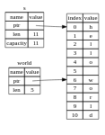

# Fatiamento

- Fatiamento é uma técnica que permite extrair partes de uma string, lista ou tupla.

- O fatiamento é feito com a sintaxe `&[start..end]`.

```rs
let s = String::from("hello world");

let hello = &s[0..5]; // "hello"
let world = &s[6..11]; // "world"
```

Em vez de uma referência ao inteiro String, helloé uma referência a uma parte do String, especificada no [0..5]bit extra. Criamos fatias usando um intervalo entre colchetes especificando [starting_index..ending_index], onde starting_indexé a primeira posição na fatia e ending_indexé uma a mais que a última posição na fatia. Internamente, a estrutura de dados da fatia armazena a posição inicial e o comprimento da fatia, que corresponde a ending_indexmenos starting_index. Portanto, no caso de let world = &s[6..11];, worldseria uma fatia que contém um ponteiro para o byte no índice 6 scom um valor de comprimento de 5.



Com a sintaxe de intervalo do Rust .., se quiser começar no índice 0, você pode eliminar o valor antes dos dois pontos. Em outras palavras, estes são iguais:

```rs
let s = String::from("hello");

let slice = &s[0..2];
let slice = &s[..2];
```

Da mesma forma, se o intervalo incluir o final da string, você pode eliminar o valor após os dois pontos. Estes são iguais:

```rs
let s = String::from("hello");

let len = s.len();

let slice = &s[3..len];
let slice = &s[3..];
```

Podemos criar uma função que retorna a primeira palavra de uma string:

```rs
fn first_word(s: &String) -> &str {
    let bytes = s.as_bytes(); // converte a string em um array de bytes

    for (i, &item) in bytes.iter().enumerate() { // iterando sobre os bytes
        if item == b' ' { // se encontrar um espaço
            return &s[0..i]; // retorna a fatia da string
        }
    }

    &s[..] // se não encontrar espaço, retorna a string inteira
}
```

Obtemos o índice para o final da palavra da mesma forma que fizemos na Listagem 4.7, procurando a primeira ocorrência de um espaço. Quando encontramos um espaço, retornamos uma fatia de string usando o início da string e o índice do espaço como índices inicial e final.

Agora, quando chamamos first_word, obtemos de volta um único valor vinculado aos dados subjacentes. O valor é composto por uma referência ao ponto inicial da fatia e ao número de elementos da fatia.

```rs
fn main() {
    let mut s = String::from("hello world");

    let word = first_word(&s);

    s.clear(); // error! 

    println!("the first word is: {word}");
}

```

Lembre-se das regras de empréstimo que, se tivermos uma referência imutável a algo, não podemos também adotar uma referência mutável. Como clear precisa truncar o String, ele precisa obter uma referência mutável. Depois println! da chamada to clearusa a referência in word, portanto a referência imutável ainda deve estar ativa nesse ponto. Rust não permite que a referência mutável cleare a referência imutável word existam ao mesmo tempo, e a compilação falha. Rust não apenas tornou nossa API mais fácil de usar, mas também eliminou uma classe inteira de erros em tempo de compilação!

## leterais de string e fatias

```rs
let s = "Hello, world!"; // s: &str


fn first_word(s: &str) -> &str { // funciona para &String e &str strings mutáveis e imutáveis
    let bytes = s.as_bytes(); // converte a string em um array de bytes

    for (i, &item) in bytes.iter().enumerate() { // iterando sobre os bytes
        if item == b' ' { // se encontrar um espaço
            return &s[0..i]; // retorna a fatia da string
        }
    }

    &s[..]
}

fn main() {
    let my_string = String::from("hello world");

    // first_word utiliza uma referência a `String` como argumento
    let word = first_word(&my_string[0..6]);
    let word = first_word(&my_string[..]);
   
   // first_word utilizando a referencia da string inteira
    let word = first_word(&my_string);

    // first_word utilizando o imprestimo da string em vez de referencia

    //let word = first_word(my_string); // isso não funciona, porque my_string é uma String, não uma referência ou uma str

    let my_string_literal = "hello world"; // my_string_literal: &str

    // first_word utiliza uma referência a `&str` como argumento
    let word = first_word(&my_string_literal[0..6]);
    let word = first_word(&my_string_literal[..]); // my_string_literal[..] == my_string_literal

   
    let word = first_word(my_string_literal); // Porque literais de string *são* fatias de string já,
                                              // isso também funciona, sem a sintaxe de fatia!
}

```

