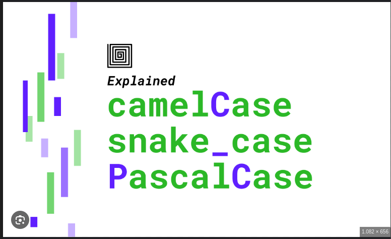

# Definindo enum

Assim com em linguaem como java, rust também tem a difnição de enum que são dados estaticos que representam um valor por definição

```rs
enum IpAddrKind {
    V4,
    V6,
}

fn main(){
    let four = IpAddrKind::V4;
    let six = IpAddrKind::v6;

    route(IpAddrKind::V4);
    route(IpAddrKind::V6);
}

    enum IpAddrKind {
        V4,
        V6,
    }

    struct IpAddr {
        kind: IpAddrKind,
        address: String,
    }

    let home = IpAddr {
        kind: IpAddrKind::V4,
        address: String::from("127.0.0.1"),
    };

    let loopback = IpAddr {
        kind: IpAddrKind::V6,
        address: String::from("::1"),
    };


fn route(ip_kind: IpAddrKind) {} // note que para tipos como strucs e enuns os tipos tem o padrão Pascal case enquanto nomes de variáveis tem o padrão Snake case

```



```rs
    enum IpAddrKind {
        V4,
        V6,
    }

    struct IpAddr {
        kind: IpAddrKind,
        address: String,
    }

    let home = IpAddr {
        kind: IpAddrKind::V4,
        address: String::from("127.0.0.1"),
    };

    let loopback = IpAddr {
        kind: IpAddrKind::V6,
        address: String::from("::1"),
    };
```

Aqui, definimos uma estrutura IpAddr que possui dois campos: um kindcampo do tipo IpAddrKind(o enum que definimos anteriormente) e um addresscampo do tipo String. Temos duas instâncias dessa estrutura. O primeiro é home, e tem o valor IpAddrKind::V4correspondente kindaos dados de endereço associados de 127.0.0.1. A segunda instância é loopback. Ele tem a outra variante de IpAddrKindcomo kindvalor, V6e tem um endereço ::1 associado a ele. Usamos uma estrutura para agrupar os valores kinde address , então agora a variante está associada ao valor.

No entanto, representar o mesmo conceito usando apenas um enum é mais conciso: em vez de um enum dentro de uma struct, podemos colocar dados diretamente em cada variante de enum. Esta nova definição do IpAddrenum diz que ambas as variantes V4e V6 terão Stringvalores associados:

```rs
        enum IpAddr {
        V4(String), //valor passado 
        V6(String),
    }

    let home = IpAddr::V4(String::from("127.0.0.1"));

    let loopback = IpAddr::V6(String::from("::1"));

```

Anexamos dados diretamente a cada variante do enum, portanto, não há necessidade de uma estrutura extra.

Há outra vantagem em usar um enum em vez de um struct: cada variante pode ter diferentes tipos e quantidades de dados associados.

```rs
    enum IpAddr {
        V4(u8, u8, u8, u8),
        V6(String),
    }

    let home = IpAddr::V4(127, 0, 0, 1);

    let loopback = IpAddr::V6(String::from("::1"));

    enum Message {
        Quit,
        Move { x: i32, y: i32 },
        Write(String),
        ChangeColor(i32, i32, i32),
    }

    //versão usando struct 
    struct QuitMessage; // unit struct
    struct MoveMessage {
        x: i32,
        y: i32,
    }
    struct WriteMessage(String); // tuple struct
    struct ChangeColorMessage(i32, i32, i32); // tuple struct


```

Mostramos várias maneiras diferentes de definir estruturas de dados para armazenar endereços IP das versões quatro e seis. No entanto, acontece que querer armazenar endereços IP e codificar o tipo deles é tão comum que a biblioteca padrão tem uma definição que podemos usar! Vejamos como a biblioteca padrão define IpAddr: ela possui a enum e as variantes exatas que definimos e usamos, mas incorpora os dados de endereço dentro das variantes na forma de duas estruturas diferentes, que são definidas de forma diferente para cada variante:

```rs
struct Ipv4Addr {
    // --snip--
}

struct Ipv6Addr {
    // --snip--
}

enum IpAddr {
    V4(Ipv4Addr),
    V6(Ipv6Addr),
}

```

Definir um enum com variantes como as da Listagem 6-2 é semelhante a definir diferentes tipos de definições de struct, exceto que o enum não usa a structpalavra-chave e todas as variantes são agrupadas sob o Message tipo. As estruturas a seguir podem conter os mesmos dados que as variantes de enum anteriores contêm:

```rs
enum Message {
    Quit,
    Move { x: i32, y: i32 },
    Write(String),
    ChangeColor(i32, i32, i32),
}

impl Message {
        fn call(&self) {
            // method body would be defined here
        }
    }

let m = Message::Write(String::from("hello"));
m.call();

```

Há mais uma similaridade entre enums e structs: assim como podemos definir métodos em structs usando impl, também podemos definir métodos em enums. Aqui está um método chamado callque poderíamos definir em nosso Messageenum:

## O OptionEnum e suas vantagens sobre valores nulos

Esta seção explora um estudo de caso de Option, que é outro enum definido pela biblioteca padrão. O Optiontipo codifica o cenário muito comum em que um valor pode ser algo ou pode ser nada.

Por exemplo, se você solicitar o primeiro item em uma lista não vazia, você obteria um valor. Se você solicitar o primeiro item em uma lista vazia, você não obteria nada. Expressar esse conceito em termos do sistema de tipos significa que o compilador pode verificar se você lidou com todos os casos que deveria estar lidando; essa funcionalidade pode evitar bugs que são extremamente comuns em outras linguagens de programação.
O problema não está realmente no conceito, mas na implementação específica. Como tal, Rust não possui nulos, mas possui um enum que pode codificar o conceito de um valor presente ou ausente. Este enum é Option<T>e é definido pela biblioteca padrão da seguinte forma:

```rs
enum Option<T> {
    None,
    Some(T),
}

```

## OptionEnum e suas vantagens sobre valores nulos

Em Rust, o tipo `Option` é usado para representar um valor que pode ou não estar presente. Ele é uma enumeração com duas variantes:

- `Some(T)`, que contém um valor de tipo `T`
- `None`, que indica a ausência de um valor

## Exemplo 1: Criando e Usando um `Option`

```rs
fn main() {
    let some_number: Option<i32> = Some(5);
    let no_number: Option<i32> = None;
    
    println!("{:?}", some_number); // Output: Some(5)
    println!("{:?}", no_number); // Output: None
}
```

## Exemplo 2: Manipulando Option com Pattern Matching

Uma forma comum de trabalhar com Option é usar pattern matching para lidar com os diferentes casos (Some ou None).

```rs
fn main() {
    let some_number: Option<i32> = Some(5);
    let no_number: Option<i32> = None;

    match some_number {
        Some(value) => println!("Tem um número: {}", value),
        None => println!("Não tem nenhum número"),
    }

    match no_number {
        Some(value) => println!("Tem um número: {}", value),
        None => println!("Não tem nenhum número"),
    }
}

```

## Exemplo 3: Usando Métodos de Option

O tipo Option possui vários métodos úteis para trabalhar com os valores, como unwrap, map, and_then, etc.

```rs
fn main() {
    let some_number: Option<i32> = Some(5);

    // Usando unwrap (não use em produção sem garantir que não seja None)
    let number = some_number.unwrap();
    println!("Número desembrulhado: {}", number); // Output: 5

    // Usando map para transformar o valor dentro de Some
    let new_number = some_number.map(|x| x + 1);
    println!("Número mapeado: {:?}", new_number); // Output: Some(6)

    // Usando and_then para encadear operações que retornam Option
    let another_number = some_number.and_then(|x| Some(x * 2));
    println!("Número transformado: {:?}", another_number); // Output: Some(10)
}
```

## Exemplo 4: Lidando com None

Para lidar com casos onde o valor pode ser None, você pode usar métodos como unwrap_or ou unwrap_or_else.

```rs
fn main() {
    let some_number: Option<i32> = Some(5);
    let no_number: Option<i32> = None;

    // Usando unwrap_or para fornecer um valor padrão
    let number = some_number.unwrap_or(0);
    println!("Número com valor padrão: {}", number); // Output: 5

    let number = no_number.unwrap_or(0);
    println!("Número com valor padrão: {}", number); // Output: 0

    // Usando unwrap_or_else para fornecer um valor padrão com lógica
    let number = no_number.unwrap_or_else(|| 2 + 3);
    println!("Número com valor padrão usando lógica: {}", number); // Output: 5
}

```

